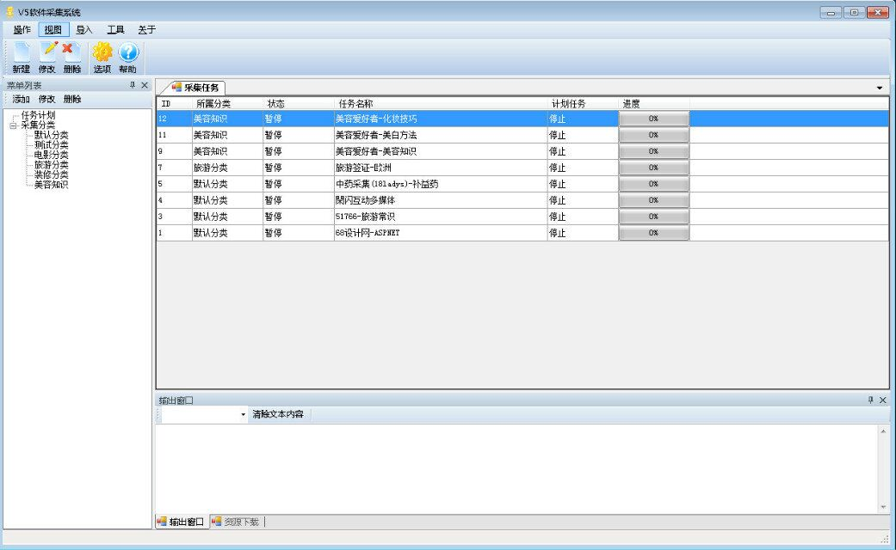
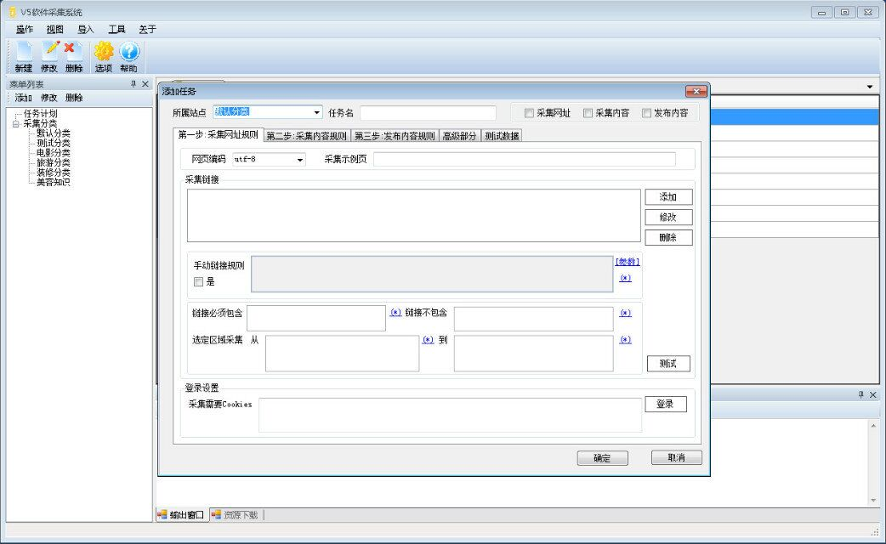
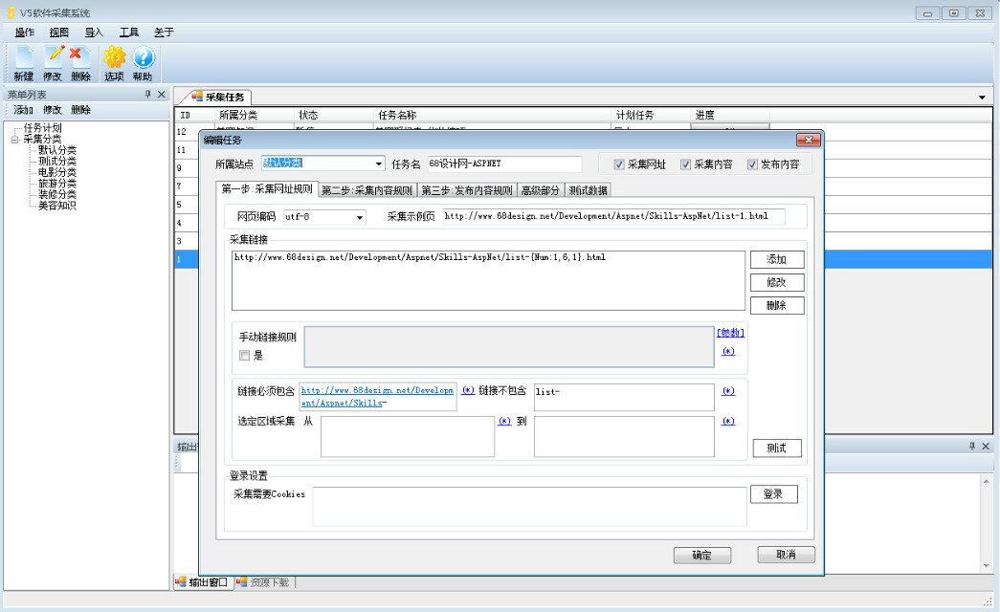
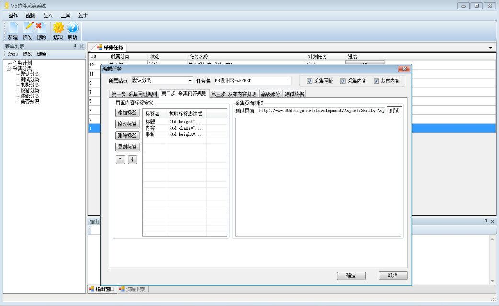
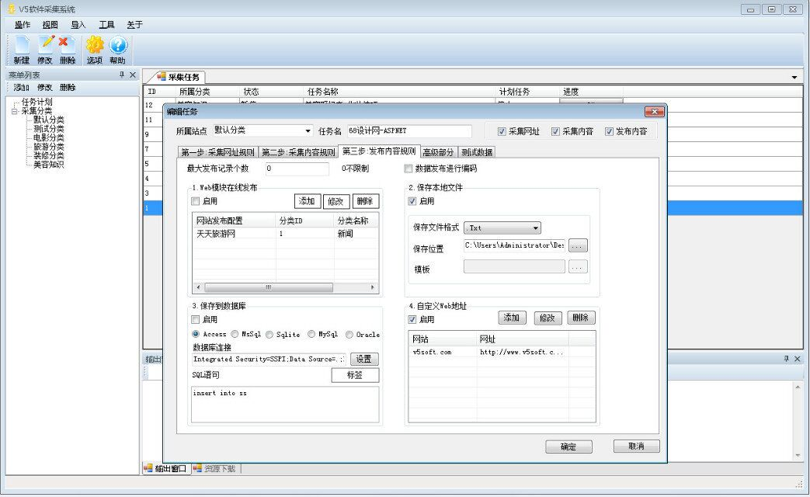

# V5数据采集器(V5_DataCollection)

- 网站:[官方网站](http://www.v5soft.com/)
- QQ群:392498279
- V5数据采集器是一款面向个人及专业用户提供的一款专业的数据采集软件,即适用于简单化配置操作，也适应针对复杂数据采集的能力,所见即可采。 V5数据采集器独有的代理轮询采集机制，可有效的解决网站屏蔽问题，可用于互联网数据动态监控，绝对是您的首选！

## 源码仓库
- [github](https://github.com/lsamu/V5_DataCollection)

## 软件截图
 
 
 
 
 

## 目录结构
- V5_AULWriter 更新写入
- V5_AutoUpdate 更新程序
- V5_DataCollection 采集主程序
- V5_DataPublish 内容发布程序
- V5_DataPublishModule 发布模块
- V5_DataWebBrowser 小型浏览器
- V5_Plugins 插件程序
- V5_WinLibs 公共类库

## 欢迎大家使用!enjoy!~~
- 软件希望得到各位的赞助，有了你们才会有更好的发展！~~~

## 更新日志
# 2016-09 更新日志
1. 增加采集列表编码 采集内容编码
2. 更新项目为.Net4.6 更新部分框架
3. 更新插件功能 优化界面功能
4. 更新图片下载功能 可以愉快的下载资源了

# 2016-08 更新日志
1. 任务开始,状态没有改变,也停止不了.
2. 新版的点测试的开始任务，不是报错就是没反应。

# 以前的不用说了~~~